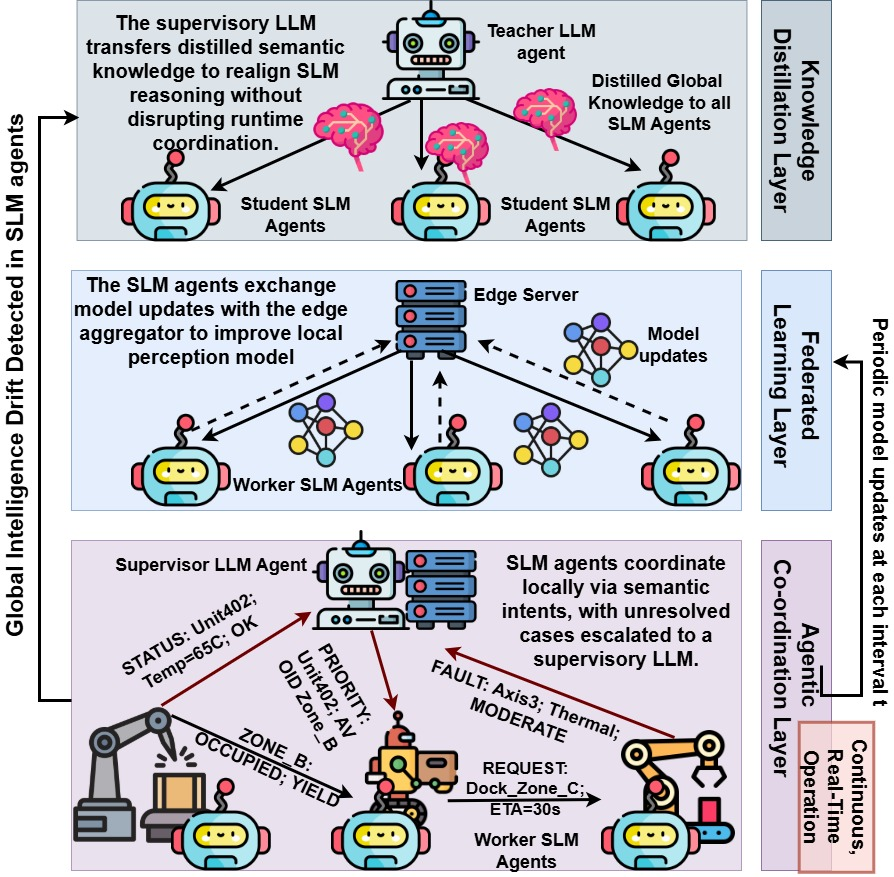

# AgentFed: SLM-Driven Agentic Communication for Smart Manufacturing
Smart manufacturing environments increasingly
rely on heterogeneous cobots and mobile automated guided
vehicles (AGVs) that must coordinate actions under strict latency,
safety, and reliability constraints. While Large Language Models
(LLMs) provide strong semantic reasoning capabilities, their
computational overhead and centralized deployment render them
unsuitable for real-time control at the factory floor. Conversely,
Small Language Models (SLMs) can operate on-device but lack
global situational awareness when acting in isolation. To bridge
this gap, this article presents AgentFed, an SLM-driven agentic
communication framework that unifies real-time local execution
with global semantic supervision for smart manufacturing sys-
tems. In AgentFed, the worker SLM agents perform low-latency
intent inference and action execution directly on cobots and
AGVs, while periodically adapting through edge-coordinated fed-
erated learning (FL) without sharing raw telemetry. A supervisor
LLM operating at the edge integrates human-specified policies
and aggregated semantic execution summaries to detect system-
level semantic drift and deliver corrective knowledge distillation
(KD) to worker agents. This separation of responsibilities enables
scalable coordination, privacy-preserving adaptation, and robust
semantic alignment across heterogeneous agents. Experimental
evaluation in a smart factory setting demonstrates that AgentFed
sustains 92.21% over 300 epochs and recovers from drift events
that reduce standalone SLM accuracy below 70%.

This repository contains the reference implementation and simulation code
for **AgentFed**, an SLM-driven agentic communication framework designed for
real-time coordination in smart manufacturing environments.

The code accompanies the paper:

> **AgentFed: An SLM-Driven Agentic Communication Framework for Smart Manufacturing**  
> (submitted / under review)

AgentFed integrates low-latency on-device Small Language Models (SLMs),
periodic federated learning (FL), and event-driven knowledge distillation (KD)
from a supervisory Large Language Model (LLM) to maintain semantic alignment,
safety compliance, and scalability under non-stationary industrial conditions.

License
This repository is released for academic and research use only.
